# 📊 Diagrama de Relacionamentos - VIU Backend

## Estrutura Completa do Banco de Dados

```mermaid
erDiagram
    USUARIOS ||--o{ PROJETOS_DESIGNER : "cria (designer)"
    USUARIOS ||--o{ PROJETOS_CLIENTE : "solicita (cliente)"
    USUARIOS ||--o{ ARTES : "cria"
    USUARIOS ||--o{ FEEDBACKS : "escreve"
    USUARIOS ||--o{ APROVACOES : "aprova"
    USUARIOS ||--o{ TAREFAS : "responsável"
    USUARIOS ||--o{ NOTIFICACOES : "recebe"
    USUARIOS ||--o{ SESSOES : "possui"
    USUARIOS ||--o{ AUDIT_LOGS : "executa"
    USUARIOS ||--o{ SECURITY_EVENTS : "relacionado"
    
    PROJETOS ||--o{ ARTES : "contém"
    PROJETOS ||--o{ TAREFAS : "possui"
    
    ARTES ||--o{ FEEDBACKS : "recebe"
    ARTES ||--o{ APROVACOES : "possui"
    ARTES ||--o{ LINK_COMPARTILHADO : "compartilhado via"
    
    USUARIOS {
        text id PK
        text email UK
        text senha "nullable"
        text nome
        text telefone "nullable"
        text avatar "nullable"
        text tipo "DEFAULT: DESIGNER"
        boolean ativo "DEFAULT: true"
        boolean twoFactorEnabled "DEFAULT: false"
        text twoFactorSecret "nullable"
        text[] twoFactorBackupCodes
        timestamp criadoEm
        timestamp atualizadoEm
    }
    
    PROJETOS_DESIGNER {
        text id PK
        text nome
        text descricao "nullable"
        text status "DEFAULT: EM_ANDAMENTO"
        int orcamento "nullable"
        timestamp prazo "nullable"
        text designerId FK
        text clienteId FK
        timestamp criadoEm
        timestamp atualizadoEm
    }
    
    PROJETOS_CLIENTE {
        text id PK
        text nome
        text descricao "nullable"
        text status "DEFAULT: EM_ANDAMENTO"
        int orcamento "nullable"
        timestamp prazo "nullable"
        text designerId FK
        text clienteId FK
        timestamp criadoEm
        timestamp atualizadoEm
    }
    
    ARTES {
        text id PK
        text nome
        text descricao "nullable"
        text arquivo
        text tipo
        int tamanho
        int versao "DEFAULT: 1"
        text status "DEFAULT: EM_ANALISE"
        text projetoId FK
        text autorId FK
        timestamp criadoEm
        timestamp atualizadoEm
    }
    
    FEEDBACKS {
        text id PK
        text conteudo
        text tipo "DEFAULT: TEXTO"
        text arquivo "nullable"
        float posicaoX "nullable"
        float posicaoY "nullable"
        text transcricao "nullable"
        text audioGerado "nullable"
        text arteId FK
        text autorId FK
        timestamp criadoEm
    }
    
    APROVACOES {
        text id PK
        text status "DEFAULT: PENDENTE"
        text comentario "nullable"
        text arteId FK
        text aprovadorId FK
        timestamp criadoEm
    }
    
    TAREFAS {
        text id PK
        text titulo
        text descricao "nullable"
        text status "DEFAULT: PENDENTE"
        text prioridade "DEFAULT: MEDIA"
        timestamp prazo "nullable"
        text projetoId FK "nullable"
        text responsavelId FK
        timestamp criadoEm
        timestamp atualizadoEm
    }
    
    NOTIFICACOES {
        text id PK
        text titulo
        text conteudo
        text tipo
        text canal "DEFAULT: SISTEMA"
        boolean lida "DEFAULT: false"
        text usuarioId FK
        timestamp criadoEm
    }
    
    SESSOES {
        text id PK
        text token UK
        timestamp expiresAt
        boolean ativo "DEFAULT: true"
        text usuarioId FK
        timestamp criadoEm
    }
    
    AUDIT_LOGS {
        text id PK
        text action
        text resource
        text resourceId "nullable"
        jsonb details "nullable"
        text ipAddress "nullable"
        text userAgent "nullable"
        text status
        text errorMessage "nullable"
        text usuarioId FK "nullable"
        timestamp criadoEm
    }
    
    SECURITY_EVENTS {
        text id PK
        text eventType
        text severity
        text description
        jsonb details "nullable"
        text ipAddress "nullable"
        text userAgent "nullable"
        text location "nullable"
        text usuarioId FK "nullable"
        boolean resolved "DEFAULT: false"
        timestamp resolvedAt "nullable"
        text resolvedBy "nullable"
        timestamp criadoEm
    }
    
    LINK_COMPARTILHADO {
        text id PK
        text token UK
        text tipo
        text arteId FK "nullable"
        boolean somenteLeitura "DEFAULT: true"
        timestamp expiraEm "nullable"
        timestamp criadoEm
    }
```

## 📝 Descrição dos Relacionamentos

### 👤 USUARIOS (Tabela Central)

**Relacionamentos como Designer:**
- `1:N` com **PROJETOS** (um designer cria vários projetos)

**Relacionamentos como Cliente:**
- `1:N` com **PROJETOS** (um cliente solicita vários projetos)

**Relacionamentos como Autor:**
- `1:N` com **ARTES** (um usuário cria várias artes)
- `1:N` com **FEEDBACKS** (um usuário escreve vários feedbacks)

**Relacionamentos como Aprovador:**
- `1:N` com **APROVACOES** (um usuário aprova várias artes)

**Relacionamentos como Responsável:**
- `1:N` com **TAREFAS** (um usuário é responsável por várias tarefas)

**Outros Relacionamentos:**
- `1:N` com **NOTIFICACOES** (um usuário recebe várias notificações)
- `1:N` com **SESSOES** (um usuário possui várias sessões)
- `1:N` com **AUDIT_LOGS** (um usuário executa várias ações auditadas)
- `1:N` com **SECURITY_EVENTS** (um usuário está relacionado a vários eventos de segurança)

---

### 📁 PROJETOS

**Relacionamentos:**
- `N:1` com **USUARIOS** (designerId) - Cada projeto tem um designer
- `N:1` com **USUARIOS** (clienteId) - Cada projeto tem um cliente
- `1:N` com **ARTES** - Um projeto contém várias artes
- `1:N` com **TAREFAS** - Um projeto possui várias tarefas

**Regras de Deleção:**
- `ON DELETE RESTRICT` para designer e cliente (não pode deletar usuário se tiver projetos)
- `ON DELETE CASCADE` para artes e tarefas (deleta em cascata)

---

### 🎨 ARTES

**Relacionamentos:**
- `N:1` com **PROJETOS** - Cada arte pertence a um projeto
- `N:1` com **USUARIOS** (autorId) - Cada arte tem um autor
- `1:N` com **FEEDBACKS** - Uma arte recebe vários feedbacks
- `1:N` com **APROVACOES** - Uma arte possui várias aprovações
- `1:N` com **LINK_COMPARTILHADO** - Uma arte pode ser compartilhada via vários links

**Regras de Deleção:**
- `ON DELETE CASCADE` do projeto (se deletar projeto, deleta artes)
- `ON DELETE RESTRICT` do autor (não pode deletar autor se tiver artes)
- `ON DELETE CASCADE` para feedbacks, aprovações e links (deleta em cascata)

---

### 💬 FEEDBACKS

**Relacionamentos:**
- `N:1` com **ARTES** - Cada feedback pertence a uma arte
- `N:1` com **USUARIOS** (autorId) - Cada feedback tem um autor

**Regras de Deleção:**
- `ON DELETE CASCADE` da arte (se deletar arte, deleta feedbacks)
- `ON DELETE RESTRICT` do autor (não pode deletar autor se tiver feedbacks)

---

### ✅ APROVACOES

**Relacionamentos:**
- `N:1` com **ARTES** - Cada aprovação pertence a uma arte
- `N:1` com **USUARIOS** (aprovadorId) - Cada aprovação tem um aprovador

**Regras de Deleção:**
- `ON DELETE CASCADE` da arte (se deletar arte, deleta aprovações)
- `ON DELETE RESTRICT` do aprovador (não pode deletar aprovador se tiver aprovações)

---

### 📋 TAREFAS

**Relacionamentos:**
- `N:1` com **PROJETOS** (opcional) - Cada tarefa pode pertencer a um projeto
- `N:1` com **USUARIOS** (responsavelId) - Cada tarefa tem um responsável

**Regras de Deleção:**
- `ON DELETE CASCADE` do projeto (se deletar projeto, deleta tarefas)
- `ON DELETE RESTRICT` do responsável (não pode deletar responsável se tiver tarefas)

---

### 🔔 NOTIFICACOES

**Relacionamentos:**
- `N:1` com **USUARIOS** - Cada notificação pertence a um usuário

**Regras de Deleção:**
- `ON DELETE CASCADE` do usuário (se deletar usuário, deleta notificações)

---

### 🔐 SESSOES

**Relacionamentos:**
- `N:1` com **USUARIOS** - Cada sessão pertence a um usuário

**Regras de Deleção:**
- `ON DELETE CASCADE` do usuário (se deletar usuário, deleta sessões)

---

### 📝 AUDIT_LOGS

**Relacionamentos:**
- `N:1` com **USUARIOS** (opcional) - Cada log pode estar relacionado a um usuário

**Regras de Deleção:**
- `ON DELETE SET NULL` do usuário (se deletar usuário, mantém log mas remove referência)

---

### 🔒 SECURITY_EVENTS

**Relacionamentos:**
- `N:1` com **USUARIOS** (opcional) - Cada evento pode estar relacionado a um usuário

**Regras de Deleção:**
- `ON DELETE SET NULL` do usuário (se deletar usuário, mantém evento mas remove referência)

---

### 🔗 LINK_COMPARTILHADO

**Relacionamentos:**
- `N:1` com **ARTES** (opcional) - Cada link pode compartilhar uma arte

**Regras de Deleção:**
- `ON DELETE CASCADE` da arte (se deletar arte, deleta links)

---

## 🔍 Índices Criados para Performance

Todos os campos de foreign key possuem índices automáticos. Além disso, foram criados índices adicionais para:

- **usuarios**: email, tipo, ativo, criadoEm
- **projetos**: designerId, clienteId, status, criadoEm
- **artes**: projetoId, autorId, status, tipo, criadoEm
- **feedbacks**: arteId, autorId, tipo, criadoEm
- **aprovacoes**: arteId, aprovadorId, status, criadoEm
- **tarefas**: projetoId, responsavelId, status, prioridade, prazo
- **notificacoes**: usuarioId, tipo, lida, criadoEm
- **sessoes**: usuarioId, token, expiresAt, ativo
- **audit_logs**: usuarioId, action, resource, status, criadoEm
- **security_events**: usuarioId, eventType, severity, resolved, criadoEm
- **link_compartilhado**: token, arteId, expiraEm

---

## 🎯 Enums e Valores Padrão

### TipoUsuario
- `DESIGNER` (padrão)
- `CLIENTE`
- `ADMIN`

### StatusProjeto
- `EM_ANDAMENTO` (padrão)
- `CONCLUIDO`
- `CANCELADO`

### StatusArte
- `EM_ANALISE` (padrão)
- `APROVADO`
- `REJEITADO`

### TipoFeedback
- `TEXTO` (padrão)
- `AUDIO`
- `POSICIONAL`

### StatusAprovacao
- `PENDENTE` (padrão)
- `APROVADO`
- `REJEITADO`

### StatusTarefa
- `PENDENTE` (padrão)
- `EM_ANDAMENTO`
- `CONCLUIDA`

### Prioridade
- `BAIXA`
- `MEDIA` (padrão)
- `ALTA`

### TipoNotificacao
- `SISTEMA`
- `FEEDBACK`
- `APROVACAO`
- `TAREFA`

### CanalNotificacao
- `SISTEMA` (padrão)
- `EMAIL`
- `PUSH`
